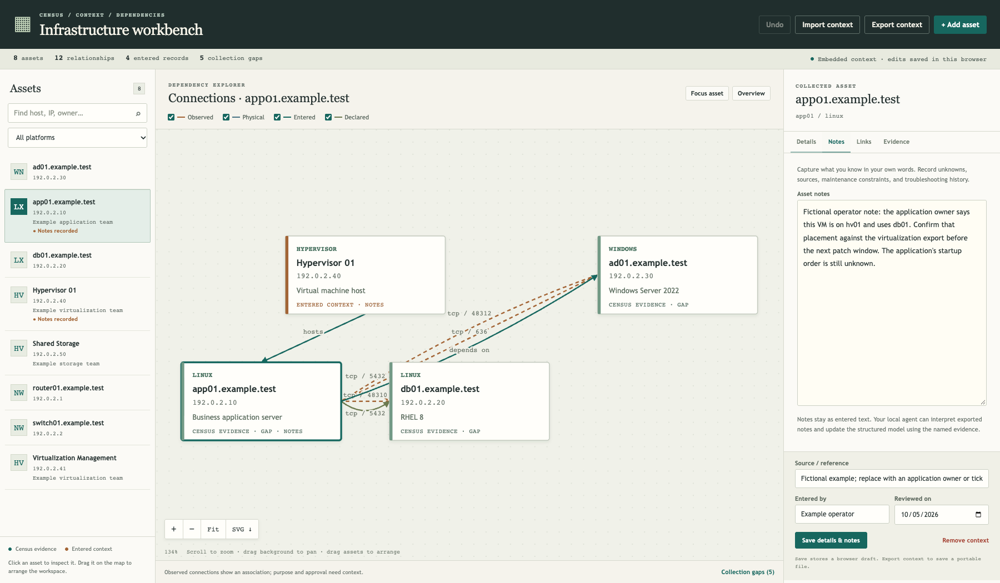
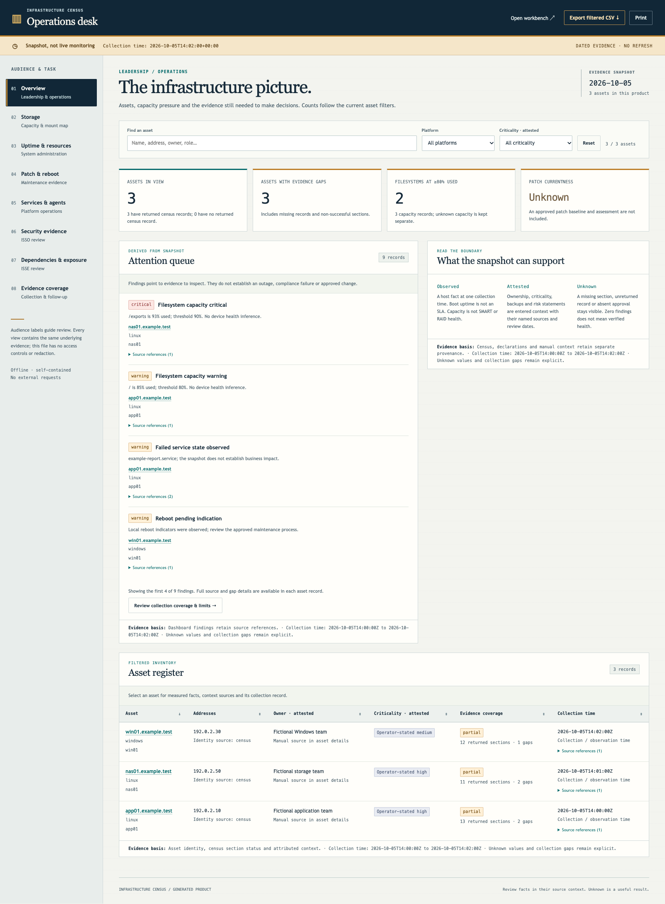

# Infrastructure Census Map

A portable Ansible census kit for an offline production environment. Collect Linux, Windows, and selected network device metadata, retain per-section gaps, and generate a searchable HTML map, an SVG diagram, JSON model, CSV matrix, and Markdown report. Feed the evidence bundle and these instructions to a local agent to explain observations and record declared dependencies.



Version 0.4.1 includes administrator, ISSO, ISSE and leadership dashboards, active/configured storage mount mapping, selected read-only health evidence and validated dashboard navigation. It retains the collect/seal/render/WinSCP workflow and existing-Ansible integration instructions. Local/CI validation is separate from live platform qualification. The generic source contains no real environment address, credential, or service assumption.

## Administrator and leadership dashboards

Open `products/dashboards.html` for storage, uptime/resources, patch/reboot evidence, services/agents, security observations, dependency/exposure review, leadership summaries and collection coverage. Search/filter assets, drill into evidence, export CSV and switch to the interactive map. No web server, cloud connection or dashboard backend is required.

Storage links identify NFS/SMB clients, providers, share/export paths and local mount points, keeping active, configured-only and unknown state distinct. Local filesystem capacity is collected without probing remote shares. Linux fstab/static supported autofs declarations and Windows current-account mappings supply configured context; unsupported/dynamic maps and other user sessions remain gaps.

These are dated snapshots, not live monitoring. Uptime is time since boot, not availability; local capacity is not SMART/RAID health; installed patches are not proof of an approved baseline; visible security services are not STIG compliance. Missing data remains Unknown. Audience labels do not redact embedded private data. See [dashboard guide](docs/admin-dashboards.md), [storage mapping](docs/storage-mapping.md) and [fictional dashboard example](examples/admin-snapshot-products/dashboards.html).



## Quick start and output download

The controller/reporting tools need Python 3.10+ with Jinja2 and PyYAML. The Linux target collector uses an already installed Python 3.6+; no target package installation is performed.

On a connected test/reporting machine, create an isolated environment:

```bash
python3 -m venv .venv
source .venv/bin/activate
python -m pip install -r requirements-reporting.txt
python tools/census.py doctor
python tools/census.py demo --run-id fictional-pilot
```

This demo contacts no targets. It generates a workbench and reports from fictional data, with output under `$HOME/census-output/fictional-pilot` and `census-fictional-pilot.tar.gz` plus its `.sha256` file beside that folder.

For air-gapped production, use the matching prepared controller environment instead of the connected pip command. See [offline-controller.md](docs/offline-controller.md). Then run:

```bash
python tools/census.py collect \
  -i inventories/private/hosts.yml \
  --run-id baseline-20261006T140000Z
```

The command prints **READY FOR WINSCP** and the exact controller paths to download. Connect WinSCP to the **Ansible controller**, using the account that ran collection, and download the archive/checksum pair. No WinSCP account, SSH/SFTP service or firewall rule is created by the kit. See [winscp-output.md](docs/winscp-output.md).

Use `--output-root /path/to/approved/census-output` to choose another writable location. Use `--limit app01` for a canary; the helper adds localhost so initialization and export still run. Optional `--manual /private/manual-context.yml` and `--declared /private/dependencies.json` include your attributed context. Output is private; never upload it to this public code repository.

## Start with an existing control node

Use a Linux control node for mixed Windows/network production collection. The controller needs Ansible and the chosen collections/connection libraries; managed network devices do not need Python. Linux baseline collection needs an existing Python 3.6+ interpreter and SSH. Windows uses installed PowerShell 5.1+ and an existing WinRM management endpoint.

For a **new standalone kit**, copy ansible.cfg.example to a privately managed Ansible configuration and create a private inventory based on inventories/example/hosts.yml. **Already have an Ansible repo? Preserve its config and inventory.** Use [the integration guide](docs/integrate-existing-ansible.md), [paste-ready local LLM task](docs/llm-integration-prompt.md) and [wrapper/overlay/settings templates](model/integration/) to add a separate census entry point beside your current playbooks. Existing host-key trust, management access, and credential handling should be supplied by your environment. The collector never enables WinRM, NETCONF, LLDP, or firewall rules.

```bash
ansible-inventory -i inventories/private/hosts.yml --graph
ansible-playbook -i inventories/private/hosts.yml playbooks/collect-census.yml \
  -e census_run_id=pilot-20261005T143000Z
```

The direct playbook also defaults to `$HOME/census-output`, generates products and creates the transfer archive. Use a new run ID each time so historical evidence is preserved. If narrowing direct playbook scope, include localhost so initialization and sealing still run:

```bash
ansible-playbook -i inventories/private/hosts.yml playbooks/collect-census.yml \
  --limit 'census_windows,localhost' \
  -e census_run_id=windows-pilot-20261005T143000Z
```

Each record has sections with independent status. `access_denied`, `not_installed`, `unsupported`, `unreachable`, and `timeout` are evidence gaps, not proof of a failed application. Expected assets with no returned document remain gaps in the map. Collection uses temporary execution files and can generate normal access logs/query-provider side effects; it makes no intentional application, package, network or firewall configuration changes. See SECURITY.md for the exact read-only boundary. `--check` is rejected for the full workflow; use `--syntax-check` for parsing only.

## Render the evidence

```bash
python tools/bundle.py verify "$HOME/census-output/pilot-20261005T143000Z"
python tools/census.py finish --bundle "$HOME/census-output/pilot-20261005T143000Z"
```

Alternatively use the controller's Ansible Python (which already provides Jinja2):

```bash
ansible-playbook playbooks/render-products.yml \
  -e census_bundle=/absolute/path/to/evidence/pilot-20261005T143000Z \
  -e census_products=/absolute/path/to/output/pilot-20261005T143000Z
```

Open `dependency-map.html` directly in a browser. It is self-contained and makes no network requests. SVG is generated directly from the model; Graphviz is not required for the prototype. The HTML Jinja template is `renderer/templates/map.html.j2`; the SVG layout is in `renderer/render.py`. An agent updates the data and reruns the renderer.

The HTML workbench supports selecting hosts, exploring their evidence, and editing manual notes/context. Draft changes can be exported as `manual-context.json` and passed to the agent or renderer with `--manual`. Browser draft persistence depends on the browser; export the context to retain a portable record. See docs/dynamic-workbench.md for the notes-to-agent workflow.

## Try the fictional example

```bash
python tools/census.py demo --run-id fictional-with-context \
  --manual model/manual-context.example.yml \
  --declared model/declared-dependencies.example.json
```

These five fictional assets include Linux, Windows, and switches with TCP and neighbor observations. The example is suitable for sharing. Real inventories, evidence, credentials, and products stay in ignored directories in the authorized environment.

## Platform guides

- docs/windows-collection.md: PSRP/WinRM, PowerShell metadata, permissions and optional AD/IIS.
- docs/network-collection.md: Cisco IOS/IOS XE, Arista EOS, optional Junos compatibility, LLDP/CDP interpretation and other vendors.
- docs/linux-collection.md: bounded allowlisted baseline and capability limits.
- docs/offline-controller.md: how to stage collections and Python dependencies for the production control node.
- docs/agent-workflow.md: how an offline Codex or Claude agent consumes evidence and generates diagrams.
- docs/integrate-existing-ansible.md: preserve the current Ansible repo and add a separate, qualified census entry point.
- docs/llm-integration-prompt.md: input worksheet and paste-ready task for the agent performing that integration.
- docs/manual-context.md: enter hypervisors, VM placement, ownership, storage, backup and dependency relationships in YAML or JSON; generate combined or manual-only maps.
- docs/dynamic-workbench.md: click hosts, edit notes/context, add manual assets/relationships, and export edits for the agent.
- docs/VALIDATION.md: exact checks and live testing still required.
- docs/winscp-output.md: output location, permissions, download and extraction.
- docs/qualification.md: platform/account canary acceptance and no-change checks.
- docs/development.md: repeatable tests, browser setup and release/privacy gate.
- docs/admin-dashboards.md: role-based snapshot views, interpretation boundaries and inputs for a local LLM.
- docs/storage-mapping.md: active/configured NFS/SMB records, exact provider matching and gaps.

## Interpretation limits

An established socket does not establish which endpoint initiated it, why the connection is needed, or whether it is approved. Listening ports show local endpoints. UDP endpoint enumeration normally does not reveal peers. LLDP/CDP reports physical neighbors, not application relationships. Point-in-time discovery misses periodic jobs; collect representative daytime, backup-window and batch-window bundles.

The prototype renders one bundle plus optional manual context. It preserves history by separate run folders; automatic multi-run reconciliation, production patch ordering, all vendor adapters, and owner approval workflows are future features. Declared dependencies are supplied explicitly as JSON and remain declared. Manual YAML/JSON can add uncollected assets and relationships; conflicting collected facts remain intact and appear in the report. The renderer does not infer architecture from model training alone.

## Add what you know manually

Copy `model/manual-context.example.yml` into your private working directory and enter hypervisors, storage, VM placement, ownership and other known facts. Then render:

```bash
python renderer/render.py --evidence examples/synthetic \
  --manual model/manual-context.example.yml --output output/synthetic-with-manual
```

Without collection access, supply all referenced assets in the manual file and omit `--evidence`. The product is explicitly labeled manual-only. For Ansible rendering, pass `census_manual_context=/absolute/path/to/manual-context.yml`; `census_bundle` is optional in that mode.

## Release and scope

MIT-licensed generic source and fictional examples are publishable; real inventory/evidence/context/products are private. The project does not include proprietary vendor corpora or a model runtime. The workbench is a single-operator offline editor, not a shared backend or live monitoring service. Source releases do not include platform-specific dependency wheels; `tools/offline.py` prepares those on matching connected staging infrastructure.
